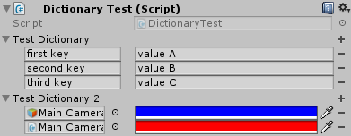
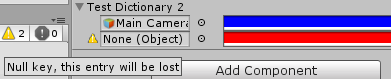

# SerializableDictionary
A serializable dictionary class for Unity.

Unity cannot serialize standard dictionaries. This means that they won't show or be edited in the inspector
and they won't be instantiated at startup. A classic workaround is to store the keys and values in separate arrays
and construct the dictionary at startup.

This project provides a generic dictionary class and its custom property drawer that solves this problem.



## Features

- It inherits from `Dictionary<TKey, TValue>`
- It implements a `CopyFrom(IDictionary<TKey, TValue>)` method to help assign values from regular dictionaries
- You can use any serializable type by unity as key or value. 
- It can be edited in the inspector without having to implement custom editors or property drawers.
- The inspector will handle invalid dictionary keys such as duplicated or `null` keys and warn the user that data loss can occur if the keys are not fixed.
    
    

    


## Limitations
- A non-generic derived class has to be created for each `<TKey, TValue>` combination you want to use. A `CustomPropertyDrawer` has to be declared for each of these classes.
- Multiple editing of scripts using `SerializableDictionaries` in the inspector is not supported. The inspector will show the dictionaries but data loss is likely to occur.
- The conflicting key detection does not work when using `LayerMask` as key. The `LayerMask` value is changed after the `CustomPropertyDrawer` execution.
- Dictionaries of lists or arrays must use the 3 arguments `SerializableDictionary<TKey, TValue, TValueStorage>` dictionary class with the extra `SerializableDictionary.Storage<TValue>` class to hold the values. See the "Dictionary of lists or arrays" section for details.


## Usage

### Simple dictionary example 

To create a serializable dictionary of type `<string, string>`:
-  Create a `SerializableDictionary` subclass
    ```csharp
    [Serializable]
    public class StringStringDictionary : SerializableDictionary<string, string> {}
    ```
- Use `StringStringDictionary` in your scripts as a normal `IDictionary<string, string>` type


### Dictionary of lists example 

To create a serializable dictionary of type `<string, List<Color>>`:
- Create a `SerializableDictionary.Storage` subclass to hold the list
    ```csharp
    [Serializable]
    public class ColorListStorage : SerializableDictionary.Storage<List<Color>> {}
    ```

-  Create a `SerializableDictionary` subclass using the previous subclass
    ```csharp
    [Serializable]
    public class StringColorListDictionary : SerializableDictionary<string, List<Color>, ColorListStorage> {}
    ```
- Use `StringColorListDictionary` in your scripts as a normal `IDictionary<string, List<Color>>` type


## Details

As Unity is unable to directly serialize generic types, create a derived class for each `SerializedDictionary` specialization you want.
```csharp
[Serializable]
public class StringStringDictionary : SerializableDictionary<string, string> {}

[Serializable]
public class MyScriptColorDictionary : SerializableDictionary<MyScript, Color> {}
```

You can use your own serializable classes.
```csharp
[Serializable]
public class MyClass
{
    public int i;
    public string str;
}

[Serializable]
public class StringMyClassDictionary : SerializableDictionary<string, MyClass> {}
```


Add the dictionaries to your scripts and access them directly of through a property.
The dictionaries can be accessed through a property of type `IDictionary<TKey, TValue>` for better encapsulation.

```csharp
public StringStringDictionary m_myDictionary1;

[SerializeField]
MyScriptColorDictionary m_myDictionary2;
public IDictionary<MyScript, Color> MyDictionary2
{
    get { return m_myDictionary2; }
    set { m_myDictionary2.CopyFrom (value); }
}

public StringMyClassDictionary m_myDictionary3;
```

The `CopyFrom(value)` method clears the `m_myDictionary2` dictionary and adds to it each of content of the `value` dictionary,  effectively copying `value` into `m_myDictionary2`.

`SerializableDictionary` has a copy constructor from `IDictionary<TKey, TValue>`. As constructors from parent classes cannot be used directly, you have to add a copy constructor to your derived classes calling the base constructor in order to use it.

```csharp
[Serializable]
public class StringColorDictionary : SerializableDictionary<string, Color>
{
    public StringColorDictionary(IDictionary<string, Color> dict) : base(dict) {}
}
```

### Dictionary of lists or arrays

Because unity cannot serialize a array of lists or an array of arrays, using a `SerializableDictionary<TKey, TValue[]>` or a `SerializableDictionary<TKey, List<TValue>>` in a script will not work properly. The dictionary will not show up in the inspector and the values will not be saved.

It is necessary to create an intermediate class that will contain the list or array. This class can then be contained in an array and be serialized by Unity.

Create a class that inherits from `SerializableDictionary.Storage<List<TValue>`. This storage class will only contain a `List<TValue> data` field.

```csharp
[Serializable]
public class ColorListStorage : SerializableDictionary.Storage<List<Color>> {}
```

If you use this storage class directly with SerializableDictionary, you will have to access the list or array through the `.data` field of the `Storage` class because your dictionary will inherit from `Dictionary<TKey, Storage<TValue>>` instead of `Dictionary<TKey, List<TValue>>`. This is far from ideal.

```csharp
// non optimal example for a dictionary of color list
[Serializable]
public class ColorListStorage : SerializableDictionary.Storage<List<Color>> {}
[Serializable]
public class StringColorListDictionary : SerializableDictionary<string, ColorListStorage> {}

public StringColorListDictionary m_colorStringListDict;

// you would have to access the color list through the .data field of ColorListStorage
List<Color> colorList = m_colorStringListDict[key].data;
```

To access the lists directly, use the special 3 arguments `SerializableDictionary<TKey, TValue, TValueStorage>` class where `TValueStorage` is the class previously created.


```csharp
[Serializable]
public class ColorListStorage : SerializableDictionary.Storage<List<Color>> {}
[Serializable]
public class StringColorListDictionary : SerializableDictionary<string, List<Color>, ColorListStorage> {}

public StringColorListDictionary m_colorStringListDict;

// you can now access directly the color list
List<Color> colorList = m_colorStringListDict[key];
```
